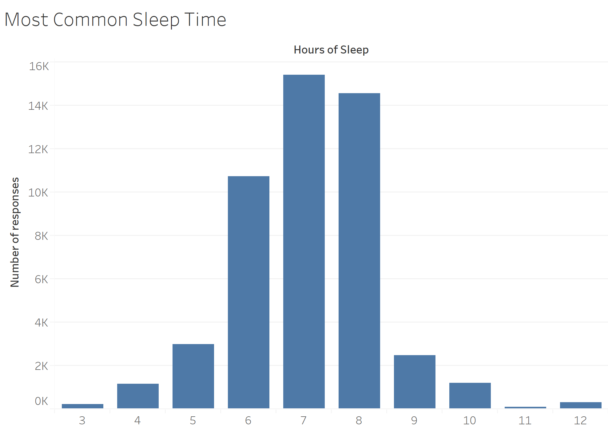
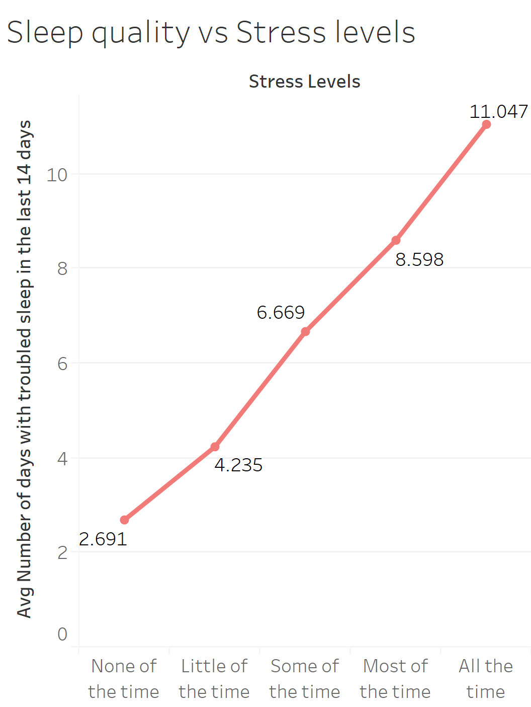
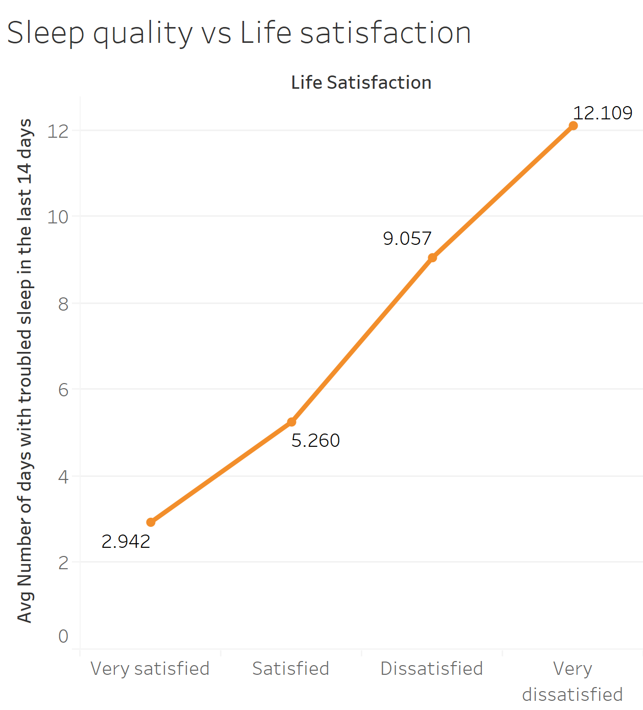
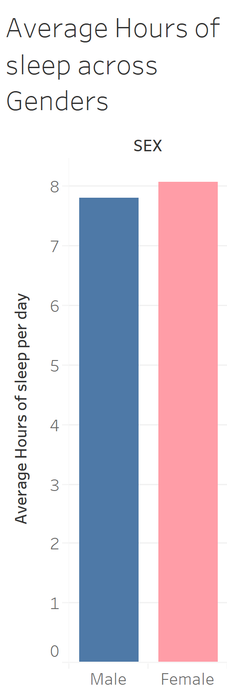
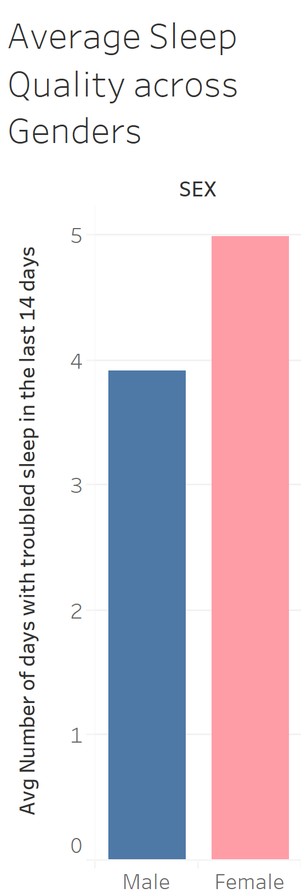
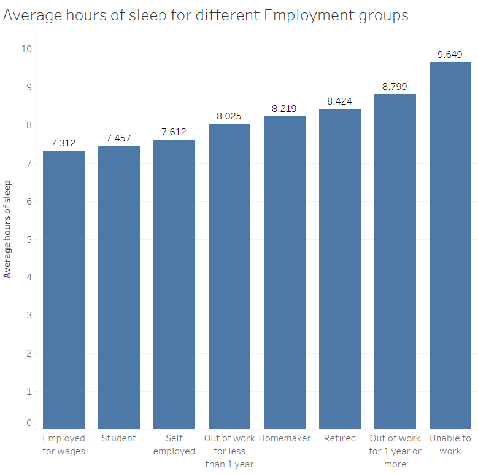
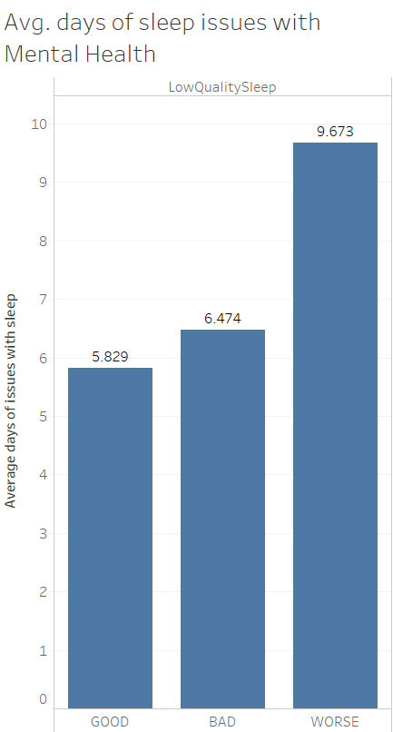

```{r setup, include=FALSE}
knitr::opts_chunk$set(echo = TRUE)
```
Libraries used in code below

```{r}
library("foreign")
library("dplyr")
library("ggplot2")
library("knitr")

```

## Summarizing the data

We have used the Behavioral Risk Factor Surveillance System (BRFSS) dataset to understand and predict sleep quality across the country. From a comprehensive list of variables, we identified the relevant variables to further analyse the sleep quality.
In this part, we mainly look at factors affecting ADSLEEP amd SLEEPTIM1 for the purposes of understanding sleep quality.

ADSLEEP - Over the last 2 weeks, how many days have you had trouble falling asleep or staying asleep or sleeping too much? 
SLEPTIM1 - On average, how many hours of sleep do you get in a 24-hour period?

Response rates are lower (~50K out of ~450K total surveyed) for these variables as sleep questions are only asked in 7 states: AZ, DC, MN, NV, ND, OR, TN. The trimmed data(~50K) was then loaded onto Tableau to analyse the sleep quality.

## Common Sleep Time

```{r}

```

The graph shows the distribution of number of hours of sleep per day. The most common answer is found to be 7 hours.

## Sleep vs Stress levels

```{r}

```

The graph shows the impact of stress levels on the quality of sleep. We can see that people who are stressed for longer periods face more trouble with sleep. As the stress levels increase, the number of days with troubled sleep also increases.

## Sleep vs Satisfaction in life

```{r}

```

The graph shows how quality of sleep is affected by level of life satisfaction. People who are more satisfied with their life have a better quality of sleep. As the level of satisfaction decreases, the number of days with troubled sleep increases.

## Sleep vs Gender

```{r}


```

The 2 graphs above show the average number of hours of sleep and the average number of day with troubled sleep for men and women. We can see that on average, women sleep for more number of hours than men. However, women face more number of days with troubled sleep as compared to men. This indicates that number of hours of sleep alone cannot be an indicator of quality of sleep.

## Sleep vs Employment

```{r}

```

The graph shows that people employed for wages reported the lowest number of hours of sleep, closely followed by students. 

## Sleep vs Mental health

```{r}

```

The graph depicts the impact of mental health on quality of sleep.

The Mental Health was divided into 3 categories:
Good : Those who did not face any mental health issue even once in last 30 days.
Bad: Those who faced mental health issues between 1 through 15 days in last 30 days.
Worse: Those who faced mental health issues for more than 15 days in last 30 days.

For those with worse mental health, the average number of days people had issues with sleep was 9.673 days which was very high as compared to those with good mental health which was 5.829. We can say that as mental health deteriorates, quality of sleep also deteriorates. 

## Exploring Sleep Data

Question 2 of the project asks us to explore the various sleep related variables in the BRFSS survey.  Our goal is to understand the data better and better define the goal of understanding sleep quality. The below code and commentary will help the reader understand our process in choosing to define the ADSLEEP variable as the best variable to represent sleep quality.  

Libraries used in code below

```{r}
library("foreign")
library("dplyr")
library("ggplot2")
```

Read in data using "foreign package"

```{r}
data <- read.xport("LLCP2017.XPT ")
```

BRFSS Survey Has Six Features Specifically Pertaining to Sleep

ADSLEEP - Over the last 2 weeks, how many days have you had trouble falling asleep or staying asleep or sleeping too much? 

SLEPTIM1 - On average, how many hours of sleep do you get in a 24-hour period?

SLEPDAY1 - Over the last 2 weeks, how many days did you unintentionally fall asleep during the day?

SLEPSNO2 - Have you ever been told that you snore loudly? 

SLEPBRTH - Has anyone ever observed that you stop breathing during your sleep?

ASNOSLEP - During the past 30 days, how many days did symptoms of asthma make it difficult for you to stay asleep? 


Response rates are lower (~50K out of ~450K total surveyed) for these variables as sleep questions are only asked in 7 states: AZ, DC, MN, NV, ND, OR, TN

For this part of the analysis, we will focus on these six features and exploring their relationships.  Responses for each feature was roughly the same around ~50,000, with the exception of ASNOSLEP, where response was minimal.  We will also focus on the rows with  data we care about in this section.   

```{r}
keep <- c("ASNOSLEP", "SLEPTIM1", "ADSLEEP", "SLEPDAY1", "SLEPSNO2", "SLEPBRTH")

Trimmeddata <- mutate(data, noadsleep = is.na(ADSLEEP))
Trimmeddata <- subset(Trimmeddata, noadsleep == FALSE)
Trimmeddata <- Trimmeddata[,-c(length(colnames(Trimmeddata)))]

sleep <- Trimmeddata[ ,keep]

```

For the purposes of understanding sleep quality, we determined that the only features we wanted to take a closer look at were ADSLEEP and SLEPTIM1.  The other four features had a very narrow focus. The below code helps us focus only on rows with complete data for these two features and cleans the data up.  For example, ADSLEEP = 88 means the respondent said they had no issues with sleeping the past 14 days.  We change answers of 88 to be zero.  We also remove rows with responses equal to 77 and 99, effectively non-responses or answers of "don't know".   


```{r}
timevdays <- data.frame(sleep[,c(2,3)])

for (i in 1:nrow(timevdays)){
  if(!complete.cases(timevdays[1,])){
    timevdays[-i,]
  }
}

for (i in 1:nrow(timevdays)){
  if(timevdays[i,2] == 88){
    timevdays[i,2] <- 0
  }
}

timevdays <- subset(timevdays, SLEPTIM1 < 76)
timevdays <- subset(timevdays, ADSLEEP < 76)
```

We can finally look at the correlation between ADSLEEP and SLEPTIM1.  A value of -0.256 tells us that increasing the number of hours of sleep doesn't tell us that the respondent felt like the slept "better"

```{r}
cor(timevdays)
```

We can also plot the relationship between the two variables.  While the correlation shows some relationship between the two variables, the plot shows that there is a lot more going on with ADSLEEP than just average hours of sleep!  

```{r}
ggplot(timevdays, aes(SLEPTIM1, ADSLEEP)) + 
  geom_point()

```

##We concluded that we should not focus on SLEPTIM1, ADSLEEP is the best variable to represent sleep quality.  

Now to explore ADSLEEP variable in more detail.  Start by creating new dataframe with ADSLEEP and other demographic variables, and cleaning up the data.

```{r}
demokeep <- c("X_STATE","X_IMPRACE","X_AGE_G","SEX","ADSLEEP")
demo <- Trimmeddata[ ,demokeep]

for (i in 1:nrow(demo)){
  if(demo[i,5] == 88){
    demo[i,5] <- 0
  }
}
demo <- subset(demo, ADSLEEP < 76)
```

Starting with some basic exploratory analysis of ADSLEEP, we see the mean response that people have trouble with sleep roughly 3 days a week on average.  The histogram shows that most responses were zero and another group of roughly 5000 response around 14 (have trouble with sleep 14 out of 14 days a week)

```{r}
summary(demo$ADSLEEP)
hist(demo$ADSLEEP, xlab = "ADSLEEP", main = "Histogram of ADSLEEP")
```

We also wanted to look at variables reponses across demographics.  In general the mean ADSLEEP response is fairly balanced across demographics. The most notable difference was across males and females.  

```{r}
#mean by state
state <- aggregate(demo$ADSLEEP~demo$X_STATE, FUN=mean)
rownames(state) <- c("AZ", "DC", "MN", "NV", "ND", "OR", "TN")
state

#mean by Race
race <- aggregate(demo$ADSLEEP~demo$X_IMPRACE, FUN=mean)
rownames(race) <- c("White", "Black", "Asian", "American Indian", "Hispanic", "Other")
race

#mean by Sex
sex <- aggregate(demo$ADSLEEP~demo$SEX, FUN=mean)
rownames(sex) <- c("Male","Female","Refused")
sex

#mean by age group
agegroup <- aggregate(demo$ADSLEEP~demo$X_AGE_G, FUN=mean)
rownames(agegroup) <- c("18-24","25-34","35-44","45-54","55-64","65+")
agegroup
```


## Can We Predict Sleep Quality Using Information in the Survey?

We want to find out if we can predict ADSLEEP and if so, what features are the most relevant?

We started with a search through all 358 features in the BRFSS data set, narrowing the list down to the 30 features we thought all had potential.  For example research shows that exercise sleep quality might be related so, we were sure to include the PA1MIN_ variable, which measures total minutes of physical activity.  


We defined our 1st pass at variables below. 
```{r}
keep <- c("X-BMI5CAT","EXERANY2","X_STATE","COLGHOUS","PHYSHLTH","MENTHLTH","BPMEDS","CHOLMED1","JOINPAI1","SEX","EMPLOY1","PREGNANT","PREDIAB1","INSULIN","CVDASPRN","ASNOSLEP","SLEPTIM1","ADSLEEP","SLEPDAY1","SLEPSNO2","SLEPBRTH","MARIJANA","LSATISFY","SDHSTRES","X_IMPRACE","X_MICHD","X_ASTHMS1","X_AGE_G","X_DRDXAR1","X_BMI5CAT","X_CHLDCNT","X_RFSMOK3","X_RFDRHV5","PA1MIN_")
```

We cleaned up our ADSLEEP variable in a similar way to our exploratory analysis in question 2.  There were also a lot of null values in across the 30 variable we chose.  We filled in the null values with "MISSING".  Allowing us to perform analyses like information gain to further narrow down the field.  

```{r}
Trimmeddata <- mutate(data, noadsleep = is.na(ADSLEEP))
Trimmeddata <- subset(Trimmeddata, noadsleep == FALSE)
Trimmeddata <- Trimmeddata[,-c(length(colnames(Trimmeddata)))]


data_say <- Trimmeddata[ , (names(Trimmeddata) %in% keep)]
data_say[is.na(data_say)] <- "MISSING"

data_say <- data_say[data_say$ADSLEEP!=77 & data_say$ADSLEEP!=99, ]

data_say$ADSLEEP[data_say$ADSLEEP==88] <- 0
```

As mentioned before, we want to see if we can predict high quality sleep or not and we have decided to use the ADSLEEP feature as the primary output for our modeling activities.  If we want to do analysis of ADSLEEP as a categoric variable, we would have to define a range of values for high quality and low quality sleep. We definied high quality sleep as have 0 days of trouble sleeping every 14 days (no trouble) and low quality sleep as 1-14 days of sleep issues out of 14 (any bad days).  

```{r}
#ad_categorical <- cut(data_say$ADSLEEP, 2, include.lowest=TRUE, labels=c("HighQualitySleep", "LowQualitySleep"))
ad_categorical <- ifelse(data_say$ADSLEEP == 0, "HighQualitySleep", "LowQualitySleep")
data_say <- cbind(data_say, ad_categorical)
```

Running tools like random forest on 30 variables is too costly from a computation perspective, so we want to determine the information gain each feature gives us for ADSLEEP to objectively narrow features down further.   

Below defines information gain forumula
```{r}

#entropy function
entropy <- function(x) {
  H <- 0
  freq.x <- as.data.frame(table(x))$Freq
  
  if (sum(freq.x) ==0){
    H <- 0 # Case shows up when calculating conditional entropies
    return (H)
  }
  p <- freq.x/sum(freq.x)
  p <- p[p > 0] # Discard zero entries (because 0 log 0 = 0)
  H= -sum(p*log2(p))
  return(H)
}

#information gain function

info.gain <- function(x,y){
  x <- as.factor(x)
  y <- as.factor(y)
  freq.class <- as.data.frame(table(y))$Freq
  ent_y =0
  ent_class = entropy(y)
  pii= sum(freq.class)
  for (i in 1:length(levels(x))){
    mask = x == levels(x)[i]
    temp = y[mask]
    freq.x <- as.data.frame(table(temp))$Freq
    ig <- entropy(temp)
    pi = sum(freq.x)
    ent_y = ent_y + ((ig * (pi)/pii)) 
  }
  IG <- ent_class - ent_y
  return(IG)
}
```

Then we list and rank our features according to information gain. The create the list of features for our final prediction analyses.  

```{r}
#list for information gain
list <- c()
list1 <- c()
list2 <- c()
for (i in 1:ncol(data_say)){
  list[[i]] <- colnames(data_say)[[i]]
  list1[[i]] <- info.gain(data_say[,i],data_say$ADSLEEP)
  list2[i] <- colnames(data_say)[i]
}
data_ig<- do.call(rbind, Map(data.frame,"info gain"=list1 , "name of variable"=list2))


data_ig<- data_ig[order(-data_ig$info.gain),]
data_for_regresiion <- head(data_ig,12)['name.of.variable']
data_for_regresiion


```

Create a new data frame with our final variables.
```{r}
name1 <- c('PA1MIN_','SLEPTIM1','MENTHLTH','PHYSHLTH','X_DRDXAR1','SDHSTRES','SLEPDAY1','JOINPAI1','EMPLOY1','LSATISFY','ad_categorical')
my.data <- data_say[name1]

my.data[,name1] <- lapply(my.data[,name1] , factor)

```

We've done a good job of cleaning up the data for ADSLEEP, but we haven't yet done the same for the other features.  The below code removes "no responses" and "don't know" responses where appropriate, sets values that are effectively a zero to zero where appropriate and imputes median values for missing values. This allows data that may have been a factor before to be numeric if it makes more sense to do so.  

```{r}

#clean up PA1MIN_ this data should be numeric, no missing values to impute.   
my.data$PA1MIN_ <- as.numeric(my.data$PA1MIN_)

#clean up SLEPTIM1, values of 77, 99 or missing imputed with median values.  Make numeric After.   
SLEPTIM1Good <- subset(my.data$SLEPTIM1, as.numeric(my.data$SLEPTIM1) < 76)
SLEPTIM1Good <- as.numeric(SLEPTIM1Good)
#find median
summary(SLEPTIM1Good)
#impute median of 7 into missing values
for (i in 1:nrow(my.data)){
  if(my.data$SLEPTIM1[[i]] == 77 | my.data$SLEPTIM1[[i]] == 99){
    my.data$SLEPTIM1[[i]] <- 7
  }
}
#make numeric
my.data$SLEPTIM1 <- as.numeric(my.data$SLEPTIM1)

#Clean up MENTHLTH by making values of 88 = 0 and imputing median values for values MISSING, 77, and 99
my.data$MENTHLTH <- as.numeric(my.data$MENTHLTH)
my.data$MENTHLTH[data_say$MENTHLTH==88] <- 0

MENTHLTHGood <- subset(my.data$MENTHLTH, as.numeric(my.data$MENTHLTH) < 76)
MENTHLTHGood <- as.numeric(MENTHLTHGood)
#find avg value
summary(MENTHLTHGood)
#impute avg into missing rows
for (i in 1:nrow(my.data)){
  if(my.data$MENTHLTH[[i]] == 77 | my.data$MENTHLTH[[i]] == 99){
    my.data$MENTHLTH[[i]] <- 0
  }
}

#Clean up PHYSHLTH by making values of 88 = 0 and imputing median values for values MISSING, 77, and 99
my.data$PHYSHLTH <- as.numeric(my.data$PHYSHLTH)
my.data$PHYSHLTH[data_say$PHYSHLTH==88] <- 0

PHYSHLTHGood <- subset(my.data$PHYSHLTH, as.numeric(my.data$PHYSHLTH) < 76)
PHYSHLTHGood <- as.numeric(PHYSHLTHGood)
#find avg value
summary(PHYSHLTHGood)
#impute avg into missing rows
for (i in 1:nrow(my.data)){
  if(my.data$PHYSHLTH[[i]] == 77 | my.data$PHYSHLTH[[i]] == 99){
    my.data$PHYSHLTH[[i]] <- 0
  }
}

#No changes to X_DRD

#Clean Up SLEPDAY1 by imputing median values into MISSING, 77 and 99, setting 88 to zero
my.data$SLEPDAY1 <- as.numeric(my.data$SLEPDAY1)
my.data$SLEPDAY1[data_say$SLEPDAY1==88] <- 0

SLEPDAY1Good <- subset(my.data$SLEPDAY1, as.numeric(my.data$SLEPDAY1) < 76)
SLEPDAY1Good <- as.numeric(SLEPDAY1Good)
#find avg value
summary(SLEPDAY1Good)
#impute median into missing rows
for (i in 1:nrow(my.data)){
  if(my.data$SLEPDAY1[[i]] == 77 | my.data$SLEPDAY1[[i]] == 99){
    my.data$SLEPDAY1[[i]] <- 0
  }
}
```

We can finally run various tools to see how well we can predict high quality sleep.  Doing CV with this much data proved difficult from a computation perspective, but we divide the data into training and test sets to ensure our measures of performance are not as skewed by issues like overfitting.   In question 2 we saw good balance between ADSLEEP and various demographic features, therefore we feel like randomly selecting a test and training set will give us biased data.   

Naive Bayes
```{r}
library(e1071)
library(caret)
data_idx   = sample(nrow(my.data), 0.8*nrow(my.data))
train = my.data[data_idx, ]
test = my.data[-data_idx, ]
model_nb = naiveBayes(ad_categorical ~ ., data = train)
x_test = test[,1:10]
y_test <- test[,11]
predictions <- predict(model_nb, x_test)
df_nb <- ifelse(predictions=="HighQualitySleep",1,0)
confusionMatrix(predictions, y_test)
```


Random Forest
```{r}
library(randomForest)
forest <- randomForest(ad_categorical~.,data = train)
predictions <- predict(forest,x_test)
df_random <- ifelse(predictions=="HighQualitySleep",1,0)
confusionMatrix(predictions, y_test)
```
Now lets create a decision tree and visualize it to understand the data better. From the decision tree, we can see that the mental health contributes the most as an indidcator of sleep quality.
```{r}
library(rpart.plot)
rpart_model <- rpart(ad_categorical~.,data = my.data, method="class")
rpart.plot(rpart_model)
```

Logistic Regression
```{r}
log_reg <- glm(ad_categorical~., data = train, family = "binomial")
fit_logistic <- train(ad_categorical~.,
                      data = train,
                      method = "glmnet",
                      family = "binomial")
predictions <- predict(fit_logistic,x_test)
df_log<- ifelse(predictions=="HighQualitySleep",1,0)
confusionMatrix(predictions, y_test)
```

One advantage of randomForest is that we can use the information to list and plot the most important variables.  The below plot shows the mean decrease in gini index is the highest for PA1MIN_, a measure for the total minites of physical activity, followed by the number of hours of sleep, mental health, physical health and employment.

```{r}
varImpPlot(forest,type=2)
```
Now let us plot the roc curve and compare the models. From the ROC curve, we can observe that the AUC for Random forest is the highest 

```{r}
library(ROCR)

df_constant <- ifelse(y_test=="HighQualitySleep",1,0)
pred_log = prediction(df_log, df_constant)
pred_nb = prediction(df_nb, df_constant)
pred_random = prediction(df_random, df_constant)


roc_log = performance(pred_log, measure="tpr", x.measure="fpr")
roc_nb =  performance(pred_nb, measure="tpr", x.measure="fpr")
roc_random = performance(pred_random, measure="tpr", x.measure="fpr")

plot(roc_log, col="orange", lwd=2) 
plot(roc_nb, add=TRUE, col='red')
plot(roc_random, add=TRUE, col='green')
legend("topleft", legend=c("RANDOM FOREST", "NAIVE BAYES","LOG REGRESSION"),
       col=c("green", "red","orange"), lty=1:2)

```


